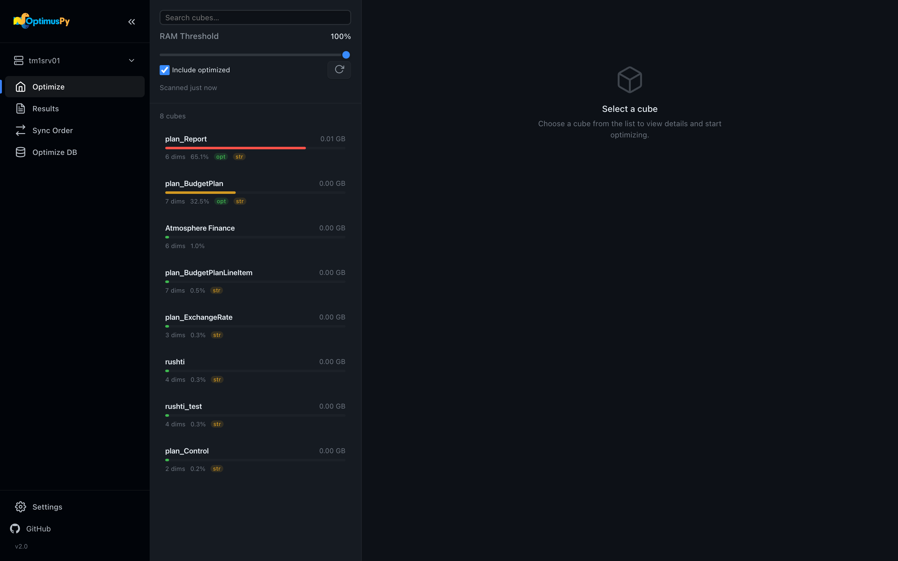

<div class="optimus-banner" markdown>
## Quick Start

Get from a fresh install to your first optimized cube in under 10 minutes.

[← Back to the landing page](https://cubewise-code.github.io/optimus-py/){ .back-link }
</div>

## Step 1 — Configure config.ini

Open `config/config.ini` and add a section per TM1 instance. Each section name becomes the `instance` value in cube configs.

```ini
[tm1srv01]
address=localhost
port=12354
user=admin
password=apple
ssl=False
async_requests_mode=true
```

For IBM Cloud / Planning Analytics on Cloud, use `base_url` + `namespace` instead of `address` + `port`. See [TM1 Connection](tm1-connection.md) for all parameters.

## Step 2 — Launch the UI

```bash
python -m optimuspy.ui
```

Your browser opens at `http://127.0.0.1:8765`.



## Step 3 — Connect & scan

In the sidebar, click the **instance switcher** at the top and pick the instance you just configured. The UI tests the connection and scans the model.

The Optimize page lists candidate cubes ranked by RAM consumption. By default, only **non-optimized** cubes appear (cubes whose visible order already differs from storage order are hidden — toggle **Include Optimized** to see them too).


## Step 4 — Optimize a cube

Click any cube in the list. The workspace opens with three tabs:

- **Overview** — dimension counts, leaf elements, suggested order
- **Configure** — pick a mode, choose views/processes, set executions
- **Run** — preview the JSON config and start the job

For your first run, leave **Mode = Greedy** and **Executions = 5**. Click **Run Optimization**.

> **Note:** Screenshot to be captured in a follow-up — the Configure tab requires real cube data. Today the mock exporter only produces the Optimize landing page.

## Step 5 — Review results

The job streams live progress in the sidebar Activity Monitor. When it finishes, the **Results** page lists the generated files. Open the HTML report — an interactive scatter plot shows every tested order, with the best one highlighted on the podium.

> **Note:** Screenshot to be captured in a follow-up — the HTML result report requires a real optimization run. Today the mock exporter only produces the Optimize landing page.

## What's next

- **Promote the result to PROD** → [Sync Order Page](../ui/sync-order-page.md)
- **Run from the CLI instead** → [CLI Reference](../advanced/cli-reference.md)
- **Understand the algorithm** → [How It Works](../concepts/how-it-works.md)
