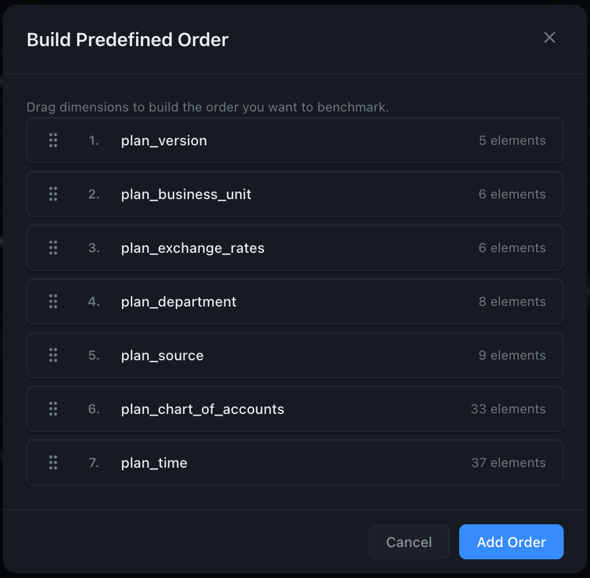

# Predefined Orders

Skip the greedy search and benchmark a hand-picked list of dimension orders. The fastest, most controlled way to compare a few candidates head-to-head.

## When to use

- You've followed **TM1 best practices** (small dims first, string dims last, density rules) and want to confirm which of two or three candidates wins.
- A colleague proposed an order and you want to compare it against the current one.
- You're **A/B testing** the result of a Greedy run against the original to confirm the gain.

## JSON config example

```json
{
  "instance": "tm1srv01",
  "cube": "Sales",
  "views": ["Optimus_Sales_View"],
  "executions": 5,
  "output": "csv",
  "predefined_orders": [
    ["Time", "Version", "Product", "Customer", "SalesMeasure"],
    ["Customer", "Product", "Version", "Time", "SalesMeasure"],
    ["Product", "Customer", "Time", "Version", "SalesMeasure"]
  ]
}
```

OptimusPy benchmarks **only** these three orders. The original order is also evaluated automatically as a baseline. No greedy search, no extra iterations.

## Building orders in the UI

The Optimize page → Configure tab → **Mode: Predefined Orders** opens a builder. Drag dimensions to reorder them, then click **Add Order** to save. The builder shows the **leaf element count** next to each dimension to help you sort by size at a glance.



You can add multiple orders to test them all in one run.

## Interaction with `orders_to_ignore`

`orders_to_ignore` is **ignored** in predefined mode — you've already explicitly listed every order you want tested. There's nothing to filter out.

## A malformed order fails the run before anything is applied

The list is validated twice at startup, and **no reorder is sent** if either gate fails.

First, before connecting to TM1, on shape alone:

```
ERROR: 'predefined_orders[0]' repeats ['Year'] — a dimension order lists each dimension once
```

Then, once the cube's storage order has been read, every entry must be a permutation of it — so a typo, a missing dimension or an extra one is caught with the offending index named:

```
ERROR: Invalid predefined_orders for cube 'Sales':
  predefined_orders[1]: order is not a permutation of the cube's dimensions
  ['Time', 'Version', 'Product', 'Measures']: ['Time', 'Version', 'Prodcut', 'Measures']
```

Every bad entry is reported at once, so a config is fixed in one pass rather than one run per typo, and the check runs before the first reorder specifically so that a typo in entry 5 cannot fail the run with entries 1-4 already applied to the cube.

## An order that moves the locked dimension is skipped, not fatal

If the cube's storage-last dimension has string elements, that slot is [locked](../concepts/string-element-constraint.md). An entry that moves it is well-formed — you asked for something coherent that TM1 will simply refuse — so OptimusPy **skips that entry and carries on with the rest of the list**. The run does not fail and does not stop.

The skipped order produces no result and is not in the result count. The reason is logged at DEBUG (`-v` to see it), with the total at INFO:

```
Skipped 1 candidate orders for cube 'Sales' (1 locked_slot)
```

So a three-order list where one entry moves the locked dimension benchmarks two orders plus the original baseline. If you expected three, check the skip count before concluding the run was short.

## CLI

```bash
optimuspy optimize sales_predefined.json
```

Output is identical to greedy mode — same HTML report, same CSV/XLSX, same podium. The only difference is the iteration count.
