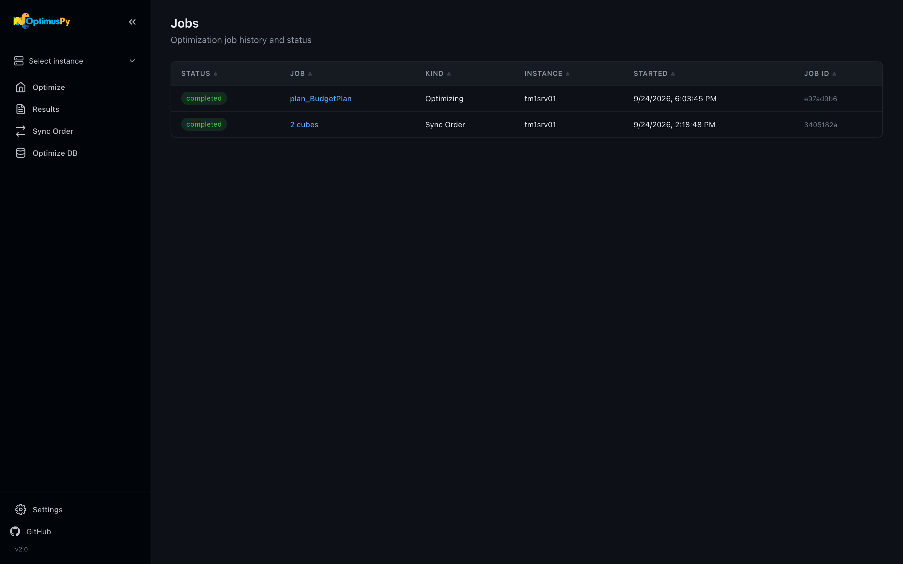

# Jobs Page

Every job the UI server has run since it started — optimizations, syncs and Optimize DB runs — newest first. The page has no sidebar item: open it at `#/jobs`.

## The job list

Each row shows:

- Status (`running`, `completed`, `failed`, `cancelled`)
- The job — its cube, Optimize DB plan id, or cube count for a sync
- Kind (Optimizing, Sync Order, Optimize DB), instance, start time and job id

The list refreshes every 10 seconds. Click a row to open the page that follows that job live: the cube's **Optimize** tab for a single-cube optimization, the Sync Order page for a sync, the Optimize DB page for a run. That page shows the job's progress live, with a **Stop** button while it runs (**Stop after current cube** for a sync or an Optimize DB run), and a job that fails is shown as failed. It works from a second browser tab or after a reload too: the log is replayed from the start.

The log stream comes over Server-Sent Events. Each iteration emits a `Testing order: [...]` event before evaluation and a `Result: RAM [GB]: X` event after.

!!! tip "Activity Monitor in the sidebar"
    While a job runs, the sidebar shows it in compact form. Click it to open that job's page from anywhere.

History resets when the UI server restarts. The result files themselves are persistent — see the [Results page](results-page.md).

## Stopping a running optimization

Click **Stop** on the cube's Optimize tab. OptimusPy:

1. Sets the cancel event flag
2. Cancels the TM1 threads the job's session is running, via `monitoring.cancel_thread`
3. Restores the cube's original VMM/VMT values (TM1 v11)
4. Restores the original dimension order **best-effort** (a no-op if the connection is already gone — the checkpoint keeps the original order, so a resume restores it)
5. Leaves the last checkpoint in place

Re-running the same config resumes from the checkpoint and recovers the order that was being tested — see [Checkpoints & Resume](../advanced/checkpoints-resume.md).

## Concurrency

Only **one** job — optimization, sync or Optimize DB run — can run at a time per UI server. Attempting to start a second job while one is running returns a `409 Conflict`.

This protects you from competing benchmarks on the same TM1 server (which would invalidate timing measurements).
