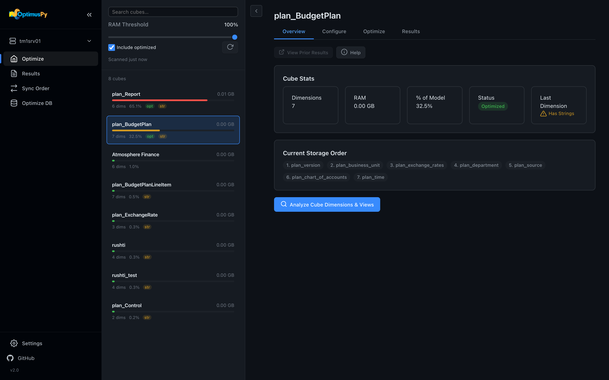
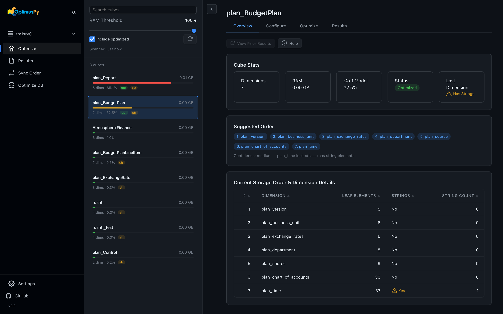
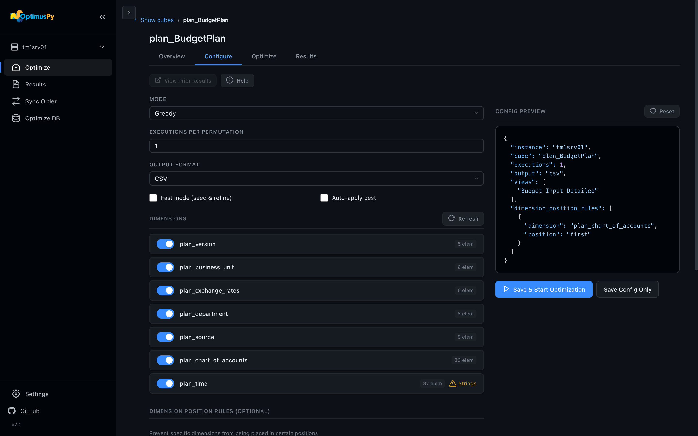
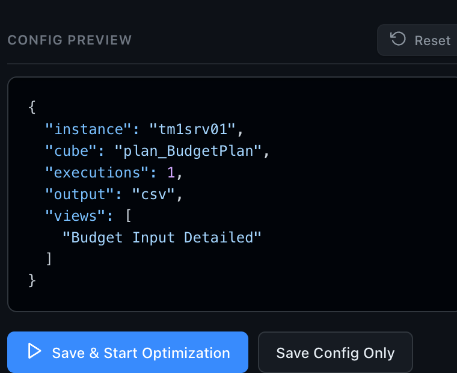

# Optimize Page

The Optimize page is the heart of OptimusPy. Connect to an instance, scan for candidate cubes, and configure benchmarks — one cube at a time or in bulk.

## Connecting & scanning

1. Pick an instance from the sidebar **Instance Switcher**. The UI runs a connection test and a fast model scan.
2. Adjust the **RAM threshold** slider to control how aggressively cubes are filtered (default: 60% of total model RAM).
3. Toggle **Include Optimized** to also list cubes that already have a custom storage order.

The scan reads from the TM1py Metrics service (`cube_memory_used`), version-agnostic across v11 and v12 — a single fast round-trip. Results are cached locally for 24 hours; click the refresh button next to **Include optimized** to scan again.

## Cube workspace

Click any cube in the list to open its workspace. Four tabs:

### Overview

Dimension table with leaf element counts, string-element flags, and a **Suggested Order**: dimensions ordered by leaf-element count, fewest first, with a string-bearing dimension kept last.

### Configure

Pick the optimization mode and tune parameters. Available modes:

- **Greedy** — full outside-in benchmark (default)
- **Predefined Orders** — test a known list of orders
- **Position** — optimize a single position
- **Dimension** — optimize a single dimension

For each mode you can:

- Pick **views** to benchmark query speed
- Pick **TI processes** to benchmark ETL time (with parameter overrides)
- Set **executions** (how many times each query/process runs — median wins)
- Set **dimensions to exclude** (kept fixed during the search)
- Set **dimension position rules** (lock specific dims to specific positions)
- Toggle **auto-apply** to write the best order back to the cube

The **Config Preview** beside the form shows the generated JSON config (it's identical to what the CLI consumes). **Save & Start Optimization** saves it to `configs/`, starts the job in the background and opens the Optimize tab. **Save Config Only** saves it without starting.

### Optimize

The job's status, elapsed time and live log, with a **Stop** button while it runs. A run that fails shows as **Failed**, with the error in the log. The tab finds the cube's job on the server, so it also shows a job started in another browser tab or before a reload, replaying its log from the start.

### Results

The cube's result files, newest first, each with an **Open** button.

## Stopping a job

Click **Stop** on the cube's Optimize tab (the sidebar Activity Monitor takes you there). OptimusPy cancels the query TM1 is running for the job, puts the cube back in its original order (best-effort), restores the original VMM/VMT on TM1 v11, and keeps the checkpoint, so re-running the same config resumes — see [Checkpoints & Resume](../advanced/checkpoints-resume.md).

## What happens next

Results land on the [Results page](results-page.md). The [Jobs page](jobs-page.md) lists every job since the UI server started.
