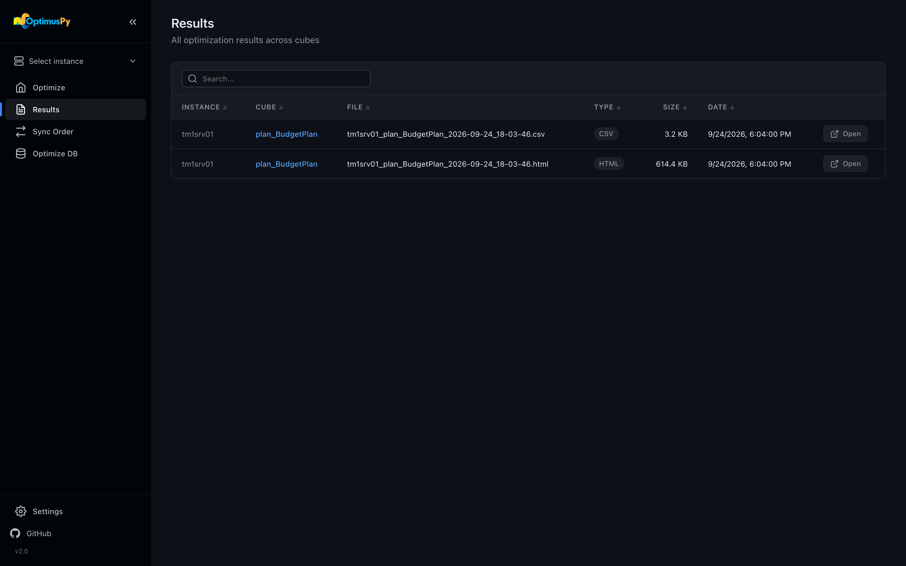
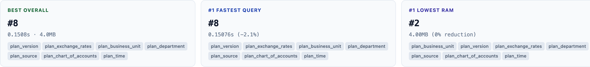
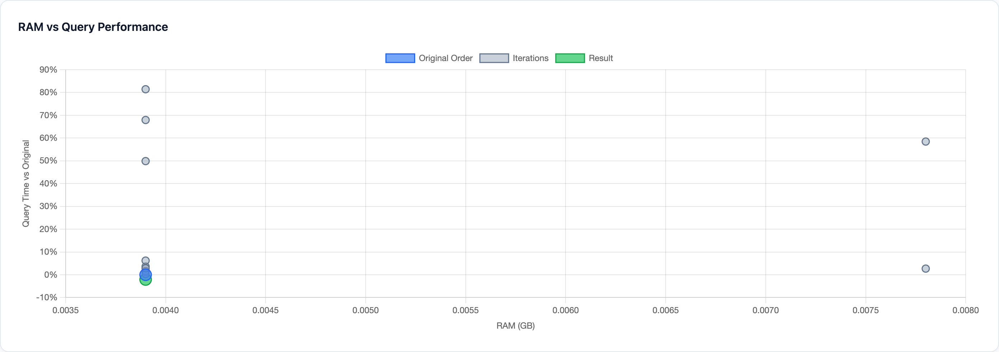

# Results Page

All optimization runs write artifacts to the local `results/` directory, in a folder per instance. The Results page lists them with most recent first and lets you open each file.



## Result file types

Every successful run generates one HTML report. Depending on the `output` field in your config, you also get a CSV or an XLSX with the raw data.

| Extension | Purpose |
|---|---|
| `.html` | Interactive report with podium + scatter chart |
| `.csv` | One row per tested permutation, all metrics |
| `.xlsx` | Same rows as the CSV on one sheet, with the original and best orders shaded |

Files are named `results/{instance}/{instance}_{cube}_{YYYY-MM-DD_HH-MM-SS}.{ext}` so they sort chronologically.

## Reading the HTML report

Open any `.html` file. Below the summary cards and the recommended dimension order, the report has three parts:

### Podium

Cards side by side: **Best Overall**, then **#1 Fastest Query** (when views were benchmarked), **#1 Fastest Process** (when processes were) and **#1 Lowest RAM**. Click a card to highlight its row in the table.



### Scatter chart (Chart.js)

Every tested permutation plotted on RAM (X) vs query time relative to the original order (Y). Hover any dot for the full order. The original order is marked in a contrasting color.



### Detail table

Every permutation, sortable. Use this when you want to dig into the raw numbers — query time and process time with their ratio to the original, RAM and its reduction, reorder time, and the dimension order.

## Downloading CSV / XLSX

Click a row's **Open** button. CSVs open in Excel / Numbers / your editor of choice. An XLSX file has one sheet: a short header (instance, cube, generation time), then one row per tested permutation.

## Where results live on disk

```
results/
└── tm1srv01/
    ├── tm1srv01_Sales_2026-04-01_15-23-44.html
    ├── tm1srv01_Sales_2026-04-01_15-23-44.csv
    └── tm1srv01_Budget_2026-04-01_16-02-11.html
```

Files are never auto-deleted — clean up old runs manually.

## Checkpoint files

Files named `checkpoint_*.json` in `results/` are mid-run state snapshots used by the resume feature. They're hidden from the Results page list. See [Checkpoints & Resume](../advanced/checkpoints-resume.md).
